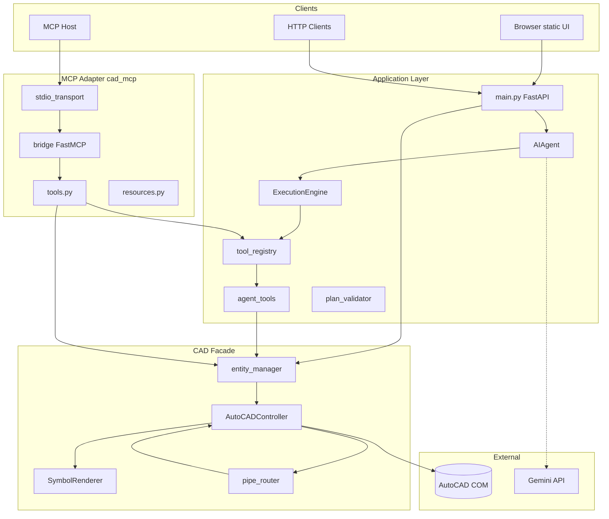
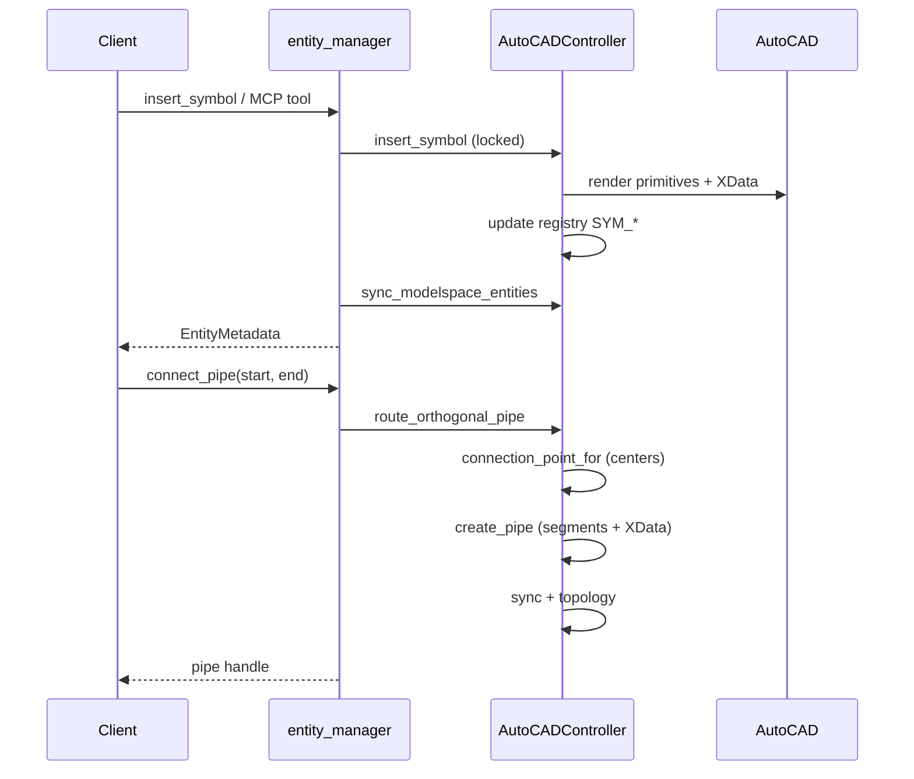

# CAD MCP Platform — Technical Architecture

This document describes the **end-to-end technical architecture** of the repository: runtime layers, data models, control flows, threading, persistence, and integration surfaces. It is intended for engineers onboarding to the codebase or extending the system without breaking invariants.

For a shorter operational guide, see [README.md](README.md). For historical implementation notes, see [ARCHITECTURE_AND_IMPLEMENTATION.md](ARCHITECTURE_AND_IMPLEMENTATION.md).

---

## 1. Executive summary

The platform is a **local orchestration stack** with three client surfaces that converge on one CAD backend:

```
┌─────────────────┐  ┌─────────────────┐  ┌──────────────────────────┐
│  Browser UI     │  │  REST (FastAPI) │  │  MCP clients             │
│  static/app.js  │  │  main.py        │  │  Cursor / Claude / etc.  │
└────────┬────────┘  └────────┬────────┘  └────────────┬─────────────┘
         │                    │                         │
         │                    │                         │
         └────────────────────┼─────────────────────────┘
                              ▼
                    ┌───────────────────┐
                    │  entity_manager   │  ← RLock, COM retry, single controller
                    └─────────┬─────────┘
                              ▼
                    ┌───────────────────┐
                    │ AutoCADController │  ← COM, registry, sync, XData
                    └─────────┬─────────┘
                              ▼
                    ┌───────────────────┐
                    │ AutoCAD.Application│
                    │ ModelSpace         │
                    └───────────────────┘

Parallel path for natural language:

```
User message → AIAgent → ExecutionPlan → plan_validator → ExecutionEngine
    → tool_registry → agent_tools → entity_manager → AutoCADController
```

**Invariant:** No surface talks to AutoCAD COM except through `AutoCADController`, reached via `entity_manager`.

---

## 2. Technology stack

| Layer | Technology | Role |
|-------|------------|------|
| Runtime | Python 3.11+ | Application language |
| Web API | FastAPI, Uvicorn | HTTP server, OpenAPI models |
| Desktop CAD | AutoCAD + COM | Drawing host |
| COM bridge | `pywin32` | `win32com.client`, VARIANT helpers |
| AI planner | `google-genai` or `google-generativeai` | Optional Gemini plans |
| MCP SDK | `mcp` (PyPI) | FastMCP server for external clients |
| Config | `python-dotenv`, Pydantic | Environment and request validation |
| Frontend | Static HTML/CSS/JS | No separate frontend build step |

---

## 3. Repository module map

### 3.1 Core CAD runtime (always loaded for CAD operations)

| Module | Responsibility |
|--------|----------------|
| `autocad_controller.py` | COM lifecycle, `entity_registry`, `primitive_owners`, topology graph, symbol insert, pipe create, move/rotate/delete, `sync_modelspace_entities`, XData read/write |
| `entity_manager.py` | Process-wide `AutoCADController` singleton, `threading.RLock`, `_with_com_retry`, public API used by REST/agent/MCP |
| `pipe_router.py` | Resolve handles, compute orthogonal route, call `create_pipe` |
| `symbol_renderer.py` | Load `symbol_templates.json`, emit lines/arcs/text/hatch into ModelSpace |
| `symbol_templates.json` | Per-symbol primitive geometry; includes `ports` metadata (normalized offsets) |
| `com_utils.py` | `to_variant_point`, `to_variant_points` for COM |
| `schemas.py` | `SymbolInsertRequest`, `MoveRequest`, `EntityMetadata`, `DrawingDetails`, etc. |

### 3.2 Agent stack

| Module | Responsibility |
|--------|----------------|
| `agent_engine.py` | `AIAgent`: plan construction (Gemini/fallback), validation retry, chat synthesis, orchestrates execution |
| `agent_tools.py` | Concrete tool functions + `TOOL_SCHEMAS` for LLM JSON |
| `tool_registry.py` | `TOOLS` map, `execute_tool`, result normalization (`entity_handle` → `handle`) |
| `execution_engine.py` | Runs `ExecutionPlan` steps, resolves `$stepN.field`, optional layout finalization |
| `execution_models.py` | `ExecutionPlan`, `ExecutionStep` Pydantic models |
| `plan_validator.py` | Validates plans against `TOOL_SCHEMAS`, symbol list, aliases; one retry with feedback |
| `agent_context.py` | `get_cad_context`, `build_context_summary` for prompts |
| `agent_memory.py` | Conversation history, tool results, `$last_entity` |
| `symbol_aliases.py` | Phrase → canonical symbol name |

### 3.3 HTTP presentation

| Module | Responsibility |
|--------|----------------|
| `main.py` | FastAPI routes, CORS, static mount, `AIAgent` singleton |
| `static/index.html`, `app.js`, `styles.css` | Operator UI |

### 3.4 MCP adapter package (`cad_mcp/`)

| Module | Responsibility |
|--------|----------------|
| `cad_mcp/_sdk.py` | Loads **PyPI** `FastMCP` without shadowing local package name `cad_mcp` |
| `cad_mcp/runtime/bridge.py` | Constructs `FastMCP("CAD-MCP-Server")`, registers tools/resources/prompts |
| `cad_mcp/runtime/tools.py` | `@mcp.tool()` wrappers → `entity_manager` / `tool_registry` |
| `cad_mcp/runtime/resources.py` | `@mcp.resource()` read-only CAD state URIs |
| `cad_mcp/runtime/prompts.py` | `@mcp.prompt()` templates for clients |
| `cad_mcp/runtime/discovery.py` | Dynamic `list_tools` / `list_resources` manifests |
| `cad_mcp/runtime/capabilities.py` | Capability negotiation helpers |
| `cad_mcp/adapters/entity_adapter.py` | Pydantic/COM-safe JSON serialization |
| `cad_mcp/adapters/execution_adapter.py` | `run_tool`: timing, `{success, result}` / `{success, error, tool}` |
| `cad_mcp/adapters/pipe_adapter.py` | Connect result normalization |
| `cad_mcp/transport/stdio_transport.py` | Async stdio server using official `mcp.server.stdio` |
| `cad_mcp/transport/websocket_transport.py` | Placeholder async transport scaffold |
| `cad_mcp/__main__.py` | `python -m cad_mcp` entry → `run_stdio()` |

### 3.5 Utilities and docs (non-runtime core)

`render_instruments_from_templates.py`, `pid_to_dxf.py`, `traversal.py`, `test_*.py`, `verify_*.py`, markdown guides under repo root.

---

## 4. Dual handle model (critical concept)

AutoCAD exposes **primitive** handles (hex strings). The application tracks **logical** entities:

| Prefix | Type | Meaning |
|--------|------|---------|
| `SYM_<id>` | Symbol | One instrument built from multiple primitives (group optional) |
| `PIPE_<id>` | Pipe | Logical pipe; segments are separate COM lines |
| `CAD_<raw>` | Unmanaged | Fallback for primitives without ownership |

**Resolution rules (`resolve_logical_handle`):**

1. If handle is already logical → use as-is.
2. Else look up `primitive_owners[primitive] → logical owner.
3. Else treat as raw COM handle where applicable.

**Why:** MCP/REST/agents must pass `SYM_...` to move/delete/connect — never raw hex for grouped symbols. `get_entity_by_handle` resolves logical IDs to COM objects via primitive handle lists and may call `sync_modelspace_entities` once on failure.

---

## 5. AutoCAD connection architecture

### 5.1 Connection sequence (`AutoCADController.connect`)

1. `pythoncom.CoInitialize()` for the calling thread.
2. Attach or launch `AutoCAD.Application`:
   - `GetObject(None, "AutoCAD.Application")` (preferred if AutoCAD is open)
   - `Dispatch("AutoCAD.Application")`
   - `gencache.EnsureDispatch(...)` fallback
3. Resolve `ActiveDocument` / create document if none.
4. `self.modelspace = doc.ModelSpace`
5. Ensure layers (`EQUIPMENT`, `PIPES` with colors).
6. Register application name for XData (`DIGIPID`).
7. **Full sync** (`sync_modelspace_entities(force_full=True)` on first connect.
8. Mark connected.

### 5.2 Threading and COM stability (`entity_manager`)

| Mechanism | Purpose |
|-----------|---------|
| `threading.RLock` `_controller_lock` | Serialize all CAD entry points |
| `_with_com_retry` | Retry on RPC_E_CALL_REJECTED / callee busy |
| `_ensure_controller_ready()` | Reconnect before operations if needed |

AutoCAD COM is effectively **single-threaded** from the caller’s perspective; concurrent HTTP requests must not interleave COM calls without the lock.

### 5.3 Logging policy (MCP safety)

Runtime modules use `logging` → **stderr**. The MCP stdio transport must not emit non-JSON text on **stdout** (would break JSON-RPC framing). `cad_mcp/runtime/bridge.py` configures `logging.basicConfig(..., stream=sys.stderr)`.

---

## 6. Model synchronization (`sync_modelspace_entities`)

Synchronization rebuilds in-memory state from the live drawing and XData. It is the **source of truth** for what the REST UI and agent tools see after `get_entities()`.

### 6.1 Phases (conceptual)

1. **XData ownership pass** — Scan ModelSpace; read `DIGIPID` JSON on primitives; rebuild `primitive_owners` and logical entities for symbols/pipe segments.
2. **Symbol reconstruction** — For `entity_type == "symbol"`, prefer persisted `insert_point` / `insertion_point`; geometry recovery via `_recover_symbol_insertion_point` is fallback for metadata only (not used for routing endpoint selection).
3. **Pipe reconstruction** — Aggregate segments per `PIPE_*`; restore `route_points`, ordered `segment_handles` via `segment_index` in XData.
4. **ModelSpace scan** — Update registry entries, skip owned primitives, detect unmanaged `CAD_*` entities.
5. **Stale cleanup** — Remove logical entities whose primitives disappeared.
6. **Topology** — Rebuild `connections` map (instrument → list of pipe handles).
7. Clear dirty flags / update `_last_sync_ts`.

### 6.2 Incremental sync optimization

To avoid full rebuild on every call:

| State | Behavior |
|-------|----------|
| `_dirty_entities`, `_dirty_pipes`, `_dirty_topology` | Set on mutations |
| `_execution_finalized` | When true, clean registry may skip sync if recently synced |
| `_sync_interval_seconds` | Throttle repeated full syncs (default 2s) |
| `sync_modelspace_entities(force_full=False)` | Used after most operations |

Mutations call `mark_dirty_entity` / `mark_dirty_pipe` / `mark_topology_dirty` before sync.

---

## 7. Symbol rendering pipeline

```
symbol_templates.json
        │
        ▼
SymbolRenderer.render_symbol(msp, name, x, y, scale, rotation, layer)
        │
        ▼
List of COM entities (lines, arcs, text, …)
        │
        ▼
AutoCADController.insert_symbol
  - logical_handle = SYM_<uuid>
  - attach_xdata per primitive (logical_handle, block_name, ports, insert_point, …)
  - entity_registry[logical_handle] = { metadata… }
  - sync + refresh_document
```

**Templates** define `primitives` (lines, contours, circles, texts) and optional `ports` (normalized offsets scaled at render time). **Ports** exist for future port-based routing but **current pipe routing uses center/insertion** via `connection_point_for`.

---

## 8. Pipe routing architecture

### 8.1 Entry points

- REST: `POST /pipes/connect` → `connect_instruments(ConnectRequest)` → `route_orthogonal_pipe`.
- Agent: `connect_pipe` tool → `connect_instruments` (via agent_tools / registry).
- MCP: `connect_pipe` tool in `cad_mcp/runtime/tools.py`.

### 8.2 Algorithm (`pipe_router.route_orthogonal_pipe`)

1. `sync_modelspace_entities()` (ensure registry current).
2. Resolve logical `start_handle` / `end_handle`.
3. Load COM entities via `get_entity_by_handle`.
4. **Endpoints:** `start = controller.connection_point_for(source)`, same for target.
   - For symbols: `connection_point_for` returns **insert_point / insertion_point** from registry (stable center semantics).
5. Reject identical centers.
6. `_make_orthogonal_route`: straight line if aligned H/V; else L-route `(sx,sy) → (sx,ey) → (ex,ey)`.
7. `create_pipe(start_handle, end_handle, points, layer=PIPES)`.

### 8.3 Persistence (`create_pipe`)

- Creates line segments on `PIPES` layer.
- Each segment gets XData: `logical_handle` (pipe), `entity_type=pipe_segment`, `start_handle`, `end_handle`, `segment_index`, `route_points`.
- Registers `PIPE_*` in `entity_registry` with `route_points` and endpoint metadata (`source_port` / `target_port`, default `"center"`).

**Design goal:** After sync, route geometry is restored from XData — routes are **not** recomputed from live primitive geometry unless endpoints move and a new pipe is created.

---

## 9. REST API architecture (`main.py`)

```
Client (browser)
    │ HTTP JSON
    ▼
FastAPI route handler
    │ Pydantic validation (schemas.py)
    ▼
entity_manager.* (locked)
    ▼
AutoCADController
```

| Endpoint | Backend function | Notes |
|----------|------------------|-------|
| `POST /connect` | `connect_autocad()` | Does not auto-sync all endpoints until needed |
| `GET /entities` | `get_entities()` | Syncs then returns `EntityMetadata` list |
| `POST /symbols` | `insert_symbol(SymbolInsertRequest)` | |
| `POST /entities/move` | `move_entity(MoveRequest)` | Returns updated metadata |
| `POST /entities/rotate` | `rotate_entity(RotateRequest)` | |
| `POST /entities/delete` | `delete_entity(DeleteRequest)` | |
| `POST /pipes/connect` | `connect_instruments(ConnectRequest)` | Returns `{ "connected": "<PIPE_…>" }` |
| `POST /agent/chat` | `AIAgent.process_message` | See §10 |

CORS is open (`allow_origins=["*"]`) for local dev.

---

## 10. AI agent architecture

### 10.1 Planning

```
User message
    → build_context_summary()  [agent_context + entity_manager state]
    → _construct_execution_plan()
         ├─ Gemini (google.genai or google.generativeai) if API key + SDK
         └─ _fallback_plan() deterministic keyword rules
    → validate_plan() [plan_validator]
         └─ optional one Gemini retry with validation feedback
    → if chat_only or no steps → _synthesize_chat_response()
    → else ExecutionEngine.execute_plan()
    → _synthesize_chat_response() with execution summary
```

**Environment variables:** `GOOGLE_API_KEY` or `GEMINI_API_KEY`, optional `GEMINI_MODEL` (default `gemini-flash-latest` in code).

### 10.2 Execution (`execution_engine.py`)

For each `ExecutionStep`:

1. Resolve arguments (`$step1.entity_handle`, `$last_entity`, nested dicts).
2. Coerce connect_pipe / find_free_space args if needed.
3. `tool_registry.execute_tool(tool_name, args)`.
4. Record in `AgentMemory`.
5. `refresh_entities()` after step (keeps agent aligned with drawing).
6. Validate step outcome (handle present, pipe_handle, etc.).
7. Update completion tracking (insertions / routing flags).
8. After success: `_finalize_layout_if_stable` may set `cad_controller.mark_execution_finalized(True)` and skip micro-`move_entity` steps.

### 10.3 Tool parity

| Tool name | Implementation | Used by |
|-----------|----------------|---------|
| `insert_symbol` | `agent_tools.insert_symbol_tool` | Agent (+ MCP via registry for insert) |
| `move_entity` | `move_entity` in entity_manager | Agent, MCP |
| `rotate_entity` | `rotate_entity` | Agent, MCP |
| `delete_entity` | `delete_entity` | Agent, MCP |
| `connect_pipe` | `connect_instruments` | Agent, MCP |
| `get_entities` | `get_entities` | Agent, MCP |
| `count_entities` | `count_entities_tool` | Agent, MCP |
| `find_entity` | `find_entity_tool` | Agent, MCP |
| `drawing_details` | `get_drawing_details` | Agent, MCP |
| `find_free_space_near_entity` | agent only | Not exposed on MCP tool list |

MCP `insert_symbol` uses `tool_registry.execute_tool` to preserve symbol alias behavior identical to the agent.

---

## 11. MCP server architecture

### 11.1 Package naming conflict

The repo folder is named `cad_mcp/`, while PyPI also ships a package named `mcp`. Importing `from mcp.server.fastmcp import FastMCP` from the project root would load the **local** package. **`cad_mcp/_sdk.py`** fixes this by temporarily substituting `sys.modules["mcp"]` with a stub pointing at `site-packages/mcp`, then importing `mcp.server.fastmcp.server.FastMCP`.

### 11.2 Boot sequence

```
python -m cad_mcp
  → cad_mcp/__main__.py
  → cad_mcp.transport.stdio_transport.run_stdio()
  → imports cad_mcp.runtime.bridge (registers tools/resources/prompts)
  → asyncio stdio_server → mcp.run(read, write)
```

**Lazy AutoCAD:** Importing `bridge` does **not** connect to AutoCAD. First tool/resource call that touches `entity_manager` triggers COM connect via `_ensure_controller_ready()`.

### 11.3 MCP tool response envelope

`cad_mcp/adapters/execution_adapter.run_tool` wraps calls:

**Success:**

```json
{ "success": true, "result": { ... } }
```

**Failure:**

```json
{ "success": false, "error": "message", "tool": "tool_name" }
```

### 11.4 MCP resources (read-only)

URIs such as `cad://entities`, `cad://pipes`, `cad://drawing` call `entity_manager` readers and return:

```json
{ "success": true, "data": { ... } }
```

Templates: `cad://entity/{handle}`, `cad://pipe/{handle}`, `cad://layer/{name}`.

### 11.5 Discovery and capabilities

- `get_tool_manifest()` / `get_resource_manifest()` / `get_prompt_manifest()` introspect the live FastMCP app.
- `get_server_manifest()` aggregates counts and capability flags.
- `negotiate_capabilities(client_capabilities)` intersects client/server feature flags.

Used for client compatibility (Cursor, Claude Desktop, etc.).

---

## 12. XData and topology

### 12.1 XData

- Application name: `DIGIPID` (configurable in `register_app` / `attach_xdata`).
- Payload: JSON string with `logical_handle`, `entity_type`, symbol fields, pipe segment index, `route_points`, ports, etc.
- Enables **recovery** after restart: primitives re-link to logical entities.

### 12.2 Topology graph

`connections: Dict[str, List[str]]` maps **instrument logical handle** → **pipe logical handles** connected to it. Rebuilt in `_sync_topology()` from pipe entities’ `start_handle` / `end_handle`.

Used when deleting symbols (`_delete_related_pipes`) and for future graph queries.

---

## 13. Data models (`schemas.py`)

| Model | Fields (high level) |
|-------|---------------------|
| `SymbolInsertRequest` | `block_name`, `x`, `y`, `rotation`, `layer`, `scale` |
| `MoveRequest` | `handle`, `dx`, `dy`, `dz` |
| `RotateRequest` | `handle`, `angle`, `base_x/y/z` |
| `DeleteRequest` | `handle` |
| `ConnectRequest` | `start_handle`, `end_handle` |
| `EntityMetadata` | Rich metadata for UI/agent (type, block, layer, points, pipe fields, `metadata` dict) |
| `DrawingDetails` | Document name, modelspace count, block list, layer list |

`EntityMetadata` in API responses is built from internal registry dicts via `EntityMetadata(**meta)`.

---

## 14. Browser UI architecture (`static/app.js`)

- Hard-coded `API_BASE = "http://127.0.0.1:8000"` (must match Uvicorn host/port).
- **Connect** → `/connect` → loads `/entities`.
- Symbol panel loads `/symbols/available`.
- Table displays entities; selection drives move/rotate/delete/pipe start/end.
- **Pipe connect** uses selected row handles as start/end.
- `refreshAfterModify()` retries entity fetch with backoff after mutations (COM latency).

No build step; static files served by FastAPI `StaticFiles` mount.

---

## 15. Configuration reference

| Variable | Used by | Purpose |
|----------|---------|---------|
| `GOOGLE_API_KEY` / `GEMINI_API_KEY` | `agent_engine` | Gemini planner |
| `GEMINI_MODEL` | `agent_engine` (optional override) | Model id |

`.env` loaded via `python-dotenv` in `agent_engine.py`.

---

## 16. Failure modes and operational notes

| Symptom | Likely cause | Mitigation in code |
|---------|--------------|-------------------|
| Unknown handle `SYM_…` | Stale registry or wrong id | `get_entity_by_handle` sync + retry; use logical handles |
| RPC_E_CALL_REJECTED | AutoCAD busy | `_with_com_retry` backoff |
| MCP JSON parse errors in client | stdout pollution | Use logging only; stderr only |
| Empty entities after insert | Sync timing | UI `refreshAfterModify`; server sync after insert |
| Gemini plan validation fails | Bad tool args / symbols | `plan_validator` + one retry; else chat_only fallback |
| Pipe connects to wrong point | Historical nearest-port routing | **Current:** center via `connection_point_for` |

---

## 17. Extension guidelines

When extending the system:

1. **Add CAD behavior in `AutoCADController`**, expose via `entity_manager` method.
2. **Add agent capability** as `agent_tools` + `TOOL_SCHEMAS` + register in `tool_registry.TOOLS`.
3. **Add MCP exposure** as thin wrapper in `cad_mcp/runtime/tools.py` using `run_tool`.
4. **Do not** call COM from MCP transport or FastAPI routes directly.
5. **Preserve** logical handles and XData on any new primitive-owning feature.
6. **Mark dirty** and sync after mutations to keep registry consistent.

---

## 18. Architecture diagrams

### 18.1 Component diagram



### 18.2 Sequence: insert + connect (REST or MCP)



---

## 19. Versioning note

This document reflects the codebase structure and behavior as implemented in the repository at documentation time. Module-level details (line numbers, exact log strings) may drift; treat **module boundaries and data flows** as the stable contract for architecture reviews.
