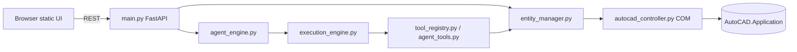

# CAD MCP Platform — Architecture & Implementation Guide

This document explains **how the AutoCAD control stack works end-to-end**: connecting to AutoCAD, editing via the browser UI, orthogonal piping between instruments, and driving changes through **Gemini** (plus deterministic fallbacks). It is written for engineers onboarding to the codebase.

---

## 1. High-level picture

The project is a **local Windows service**: a **FastAPI** HTTP server talks to a running **AutoCAD** session through **COM** (`pywin32`). A **static** web UI (`static/index.html`, `static/app.js`) calls REST endpoints to insert/move/rotate/delete symbols and connect pipes. A separate **AI agent** path (`/agent/chat`) turns natural language into a **validated tool plan**, then executes the **same** underlying CAD operations.

**Data flows (simplified)**

**Key idea:** REST and AI both converge on **`entity_manager` → `AutoCADController`**. The AI layer never talks to AutoCAD directly; it calls **tools** that wrap the same functions the HTTP API uses.

---

## 2. Repository layout (application code)

| Path | Role |
|------|------|
| `main.py` | FastAPI app, routes, mounts static files, constructs `AIAgent` |
| `entity_manager.py` | **Single façade** for CAD from HTTP + agent: locking, COM retry, `connect`, CRUD, pipe connect |
| `autocad_controller.py` | **COM engine**: connect, sync, logical registry, symbols, pipes, moves, XData |
| `pipe_router.py` | Orthogonal route between two logical entities; calls `create_pipe` |
| `symbol_renderer.py` | Renders JSON template geometry into AutoCAD primitives |
| `symbol_templates.json` | Symbol definitions consumed by renderer |
| `com_utils.py` | VARIANT helpers for COM point arguments |
| `schemas.py` | Pydantic models for REST bodies and `EntityMetadata` |
| `static/index.html`, `static/app.js`, `static/styles.css` | Browser UI |
| `agent_engine.py` | Gemini planner + deterministic fallback plans + chat synthesis |
| `agent_tools.py` | Tool implementations + `TOOL_SCHEMAS` for the LLM |
| `tool_registry.py` | Maps tool name strings → Python functions; normalizes results |
| `execution_engine.py` | Runs `ExecutionPlan` steps; resolves `$stepN.field`; validates steps |
| `execution_models.py` | `ExecutionPlan` / `ExecutionStep` Pydantic models |
| `plan_validator.py` | Validates/normalizes planner JSON; aliases; symbol checks |
| `agent_context.py` | Builds structured CAD summary for prompts (`build_context_summary`) |
| `agent_memory.py` | Conversation + tool history for `$last_entity` etc. |
| `symbol_aliases.py` | Human phrases → canonical symbol keys |
| `.env` | `GOOGLE_API_KEY`, `GEMINI_MODEL`, optional fallbacks (`python-dotenv`) |

Supporting / docs / utilities (non-runtime core):

| Path | Role |
|------|------|
| `README.md`, `DEVELOPER_GUIDE.md`, `PLAN_VALIDATION_LAYER.md` | Human documentation |
| `verify_agent_system.py`, `test_plan_validator.py`, `test_autocad.py` | Ad-hoc checks |
| `traversal.py` | Legacy/experimental traversal (may be unused by main routes) |

---

## 3. Connectivity to AutoCAD (COM)

### 3.1 Who connects

- **HTTP:** `POST /connect` → `entity_manager.connect_autocad()` → `AutoCADController.connect()`.
- **Most other CAD endpoints** call `_ensure_controller_ready()` first, which **retries** `controller.connect()` so stale COM sessions recover.

### 3.2 Connection algorithm (`autocad_controller.connect`)

Rough sequence:

1. `pythoncom.CoInitialize()` — COM apartment setup for this thread.
2. Acquire `AutoCAD.Application`:
   - Try `win32com.client.GetObject(None, "AutoCAD.Application")` (attach to running session).
   - Else `Dispatch("AutoCAD.Application")`.
   - Else `gencache.EnsureDispatch(...)` as last resort.
3. Resolve **ActiveDocument** / **Documents**:
   - Prefer `ActiveDocument`; fallback `Documents.Item(i)`; create drawing via `Documents.Add()` if empty.
   - Retries + `PumpWaitingMessages` reduce transient “not ready” failures.
4. Assign `self.modelspace = doc.ModelSpace`.
5. `_ensure_layers()`, `register_app()` (registered application name for XData, default `DIGIPID`).
6. `sync_modelspace_entities()` — rebuild in-memory registry from drawing + XData.
7. Log **Connect success**.

### 3.3 Threading and stability (`entity_manager`)

AutoCAD COM is effectively **single-threaded** and easily throws:

- **RPC_E_CALL_REJECTED** (“Call was rejected by callee”) — busy UI.
- **Cross-thread marshalling** errors — proxy used from wrong worker thread.

Mitigations implemented:

- **`RLock`** `_controller_lock`: serializes CAD operations across concurrent HTTP requests.
- **`_with_com_retry`**: detects retryable COM strings and backs off briefly.
- **`_ensure_controller_ready()`**: reconnect path before operations.

---

## 4. Logical handles vs AutoCAD primitive handles

The app tracks **two kinds** of identifiers:

| Kind | Example | Meaning |
|------|---------|---------|
| **Logical handle** | `SYM_<uuid>`, `PIPE_<hex>` | Stable **application-level** ID stored in registry + often in **XData** on primitives |
| **Raw COM handle** | `2DD`, `30A` | AutoCAD internal entity handle string |

**Why logical handles exist**

Symbols are built from **multiple** primitives (lines, arcs, text). The controller groups them under one logical symbol with shared metadata (block name, insertion concept, primitives list).

**Resolution**

- `resolve_logical_handle(raw)` maps a primitive owner → logical symbol/pipe owner when registered.
- `get_entity_by_handle` resolves logical IDs to a **live COM object** via primitive handles:
  - Never passes `SYM_...` strings directly to `HandleToObject` (that caused “Unknown handle”).
  - Tries **each** primitive handle until `HandleToObject` succeeds.
  - Runs **`sync_modelspace_entities`** once on failure, then retries.

---

## 5. Model synchronization (`sync_modelspace_entities`)

On many operations (and explicitly before pipe routing), the controller scans **ModelSpace**:

1. **XData pass:** Read JSON payload attached with registered app name (`DIGIPID`) from primitives → rebuild ownership (`primitive_owners`) and logical entities (`entity_registry`).
2. **Symbol reconstruction:** For `entity_type == "symbol"`, compute insertion-related geometry:
   - Prefer **geometry-derived** insertion (from primitives) over stale stored XData when reconciling positions after moves.
3. **Pipe reconstruction:** Pipe segments carry XData linking segment → logical `PIPE_*` and endpoints (logical instrument handles).
4. **Unmanaged entities:** Primitives without ownership may appear as `CAD_<raw>` entries.

After mutations (`insert_symbol`, `move_entity`, pipe creation), sync runs again so REST/UI/agent see consistent metadata.

---

## 6. Editing CAD via browser buttons (static UI)

### 6.1 Serving the UI

- `GET /` → `static/index.html`
- `/static/*` → static assets  
- `static/app.js` uses `fetch` against `API_BASE` (configured for your local server port; align with `uvicorn`).

### 6.2 Typical operator workflow

1. **Connect:** `POST /connect` → shows document name in badge; loads entities via `GET /entities`.
2. **Symbols panel:** Loads keys from `GET /symbols/available` (reads `symbol_templates.json`).
3. **Insert:** `POST /symbols` body matches `SymbolInsertRequest` (`schemas.py`): `block_name`, `x`, `y`, `rotation`, `layer`, `scale`.
   - Server: `insert_symbol` → `controller.insert_symbol` → renderer draws primitives → XData/logical registry updated → sync → returns `EntityMetadata`.
4. **Select row:** fills **Selected Handle** and JSON details.
5. **Move / Rotate / Delete:**  
   - `POST /entities/move`, `/entities/rotate`, `/entities/delete`  
   - Same logical-handle-aware paths as COM controller.
6. **Pipe connection:**  
   - `POST /pipes/connect` with `{ start_handle, end_handle }` (logical handles from table).  
   - UI assists: clicking entities fills Start then End (`setPipeHandlesFromSelection`).
7. **Refresh:** On CRUD/connect, UI calls **`refreshAfterModify`** (short retries) so the entity table catches COM-delayed updates.

---

## 7. Symbol rendering (`symbol_renderer.py` + templates)

- **`symbol_templates.json`** defines vector primitives per symbol name.
- **`SymbolRenderer.render_symbol`** draws into ModelSpace at `(x,y)` with scale/rotation/layer.
- Controller wraps rendered primitives into a logical **`SYM_*`** registration and attaches **XData** including logical id, entity type `symbol`, block name, layer, insertion snapshot (extended over time).

Fallback behavior exists when templates are missing (e.g., placeholder geometry) — see renderer implementation.

---

## 8. Pipe routing (`pipe_router.py` + `create_pipe`)

### 8.1 Preconditions

- `route_orthogonal_pipe` starts with **`controller.sync_modelspace_entities()`** so registry matches drawing.
- Rejects identical logical start/end handles early.

### 8.2 Anchor points (center-to-center)

Endpoints are **not** naive insertion clicks only:

- `connection_point_for(entity)` computes a **combined bounding-box center** across symbol primitives when possible (`GetBoundingBox` per primitive), falling back to insertion helpers.

### 8.3 Orthogonal geometry

`_make_orthogonal_route`:

- If aligned horizontally **or** vertically → **single segment** (pure H or V).
- Else → **L-route**: `(sx,sy) → (sx,ey) → (ex,ey)` — two segments at **90°**.

### 8.4 Persistence

`create_pipe`:

- Adds **white** polyline segments on pipes layer (`PIPES`), attaches **XData** per segment (`pipe_segment`) referencing logical pipe id and endpoint logical handles.
- Registers **`PIPE_*`** in `entity_registry`, updates topology helpers.

---

## 9. REST API surface (`main.py`)

| Method | Path | Purpose |
|--------|------|---------|
| `POST` | `/connect` | Attach COM session |
| `GET` | `/status` | Connected flag + document name |
| `GET` | `/symbols/available` | List template keys |
| `POST` | `/symbols` | Insert symbol |
| `GET` | `/entities` | List tracked entities (sync first) |
| `GET` | `/refresh` | Force sync + list |
| `GET` | `/entities/{handle}` | Single metadata |
| `POST` | `/entities/move` | Translate logical entity |
| `POST` | `/entities/rotate` | Rotate logical entity |
| `POST` | `/entities/delete` | Delete logical entity (+ related pipes where implemented) |
| `POST` | `/pipes/connect` | Orthogonal pipe between two logical handles |
| `GET` | `/count` | Registry count |
| `GET` | `/drawing/details` | Doc meta / layers / blocks |
| `POST` | `/agent/chat` | Natural language CAD agent |

---

## 10. Gemini-driven CAD changes (agent stack)

### 10.1 Entry point

`POST /agent/chat` → `AIAgent.process_message()` (`agent_engine.py`).

Phases:

1. **Memory:** Store user message (`agent_memory`).
2. **Context:** `build_context_summary()` (`agent_context.py`) — pulls entities via `get_entities()`, counts, topology from pipes, drawing info via `get_drawing_details()`, formats compact text/json-ish summary for the model.
3. **Planning:** Produce `ExecutionPlan` (`execution_models.py`).
4. **Validation:** If plan has executable steps → `validate_plan()` (`plan_validator.py`) against known tools + symbol list.
5. **Execution:** `ExecutionEngine.execute_plan()` (`execution_engine.py`).
6. **Response:** Summarize success/failure for chat transcript.

### 10.2 Planner sources (Gemini vs deterministic)

Order in `_construct_execution_plan`:

1. **Deterministic `_fallback_plan`** runs first when:
   - It can express the user intent as concrete tools (insert at coords, simple insert at origin, connect A↔B, relative placement + optional connect, counts), **or**
   - Message is simple chat intent (`hi`, symbol list questions).
2. Else if Gemini configured → `_generate_plan_with_gemini`:
   - Builds a large prompt including **`TOOL_SCHEMAS`** (from `tool_registry` / `agent_tools`) and **available symbols**.
   - Expects **JSON-only** output shaped like `{ thought, chat_only, steps:[{tool, args}] }`.
   - Parses JSON via `_extract_json_payload` (brace slicing).
3. If Gemini fails (quota/network) and deterministic plan exists → uses fallback steps after failure path.

### 10.3 Model configuration (`agent_engine.py` + `.env`)

- Reads `GOOGLE_API_KEY` or `GEMINI_API_KEY`.
- Prefers **`google.genai`** when installed; falls back to **`google.generativeai`** (legacy SDK prints deprecation warnings).
- Model selection via `GEMINI_MODEL` / `GEMINI_MODEL_FALLBACKS` / `_send_gemini_text` retry logic.

### 10.4 Validation layer (`plan_validator.py`)

Goals:

- Ensure tool names exist.
- Normalize misnamed arguments (`ARG_ALIASES`).
- Strip unsafe constructs (unsupported expressions).
- Fuzzy-fix unknown symbols toward closest valid template names when reasonable.
- Validate `$step` references shape.

On validation failure:

- Optionally **one Gemini retry** with explicit feedback (`get_validation_error_feedback`), skipped when quota errors detected.
- Else degrade to chat-only execution branch.

### 10.5 Execution (`execution_engine.py`)

For each step:

1. Substitute variables like `$step2.entity_handle`, `$step2.x`, `$last_entity`.
2. Apply **coercion helpers**:
   - `connect_pipe`: fill missing handles from prior `find_entity` matches.
   - `find_free_space_near_entity`: fill missing reference handle from step 1 matches.
3. `execute_tool` → underlying function in `agent_tools.py`.
4. **`refresh_entities()`** after each successful step — keeps registry aligned for dependent steps.
5. `_validate_step` checks expected result keys per tool (`entity_handle`, `pipe_handle`, etc.).

### 10.6 Tools (`agent_tools.py`)

Each tool wraps **`entity_manager`** calls and returns `{ success, ... }` dicts suitable for logs/UI.

Tool catalog includes:

- `insert_symbol`, `move_entity`, `rotate_entity`, `delete_entity`
- `connect_pipe`
- `get_entities`, `count_entities`, `find_entity`, `drawing_details`
- `find_free_space_near_entity`

`TOOL_SCHEMAS` mirrors JSON-schema-like descriptions injected into Gemini prompts.

### 10.7 Symbol aliases (`symbol_aliases.py`)

Maps conversational tokens (“motor”, “4 way valve”) → canonical keys present in `symbol_templates.json`, including fuzzy suggestions.

---

## 11. Persistence and XData

Logical identity and routing metadata persist inside the **DWG** via **`attach_xdata` / `read_xdata`** (`autocad_controller.py`), storing compact JSON strings under registered application **`DIGIPID`**.

This enables:

- Reloading drawings and reconstructing **`SYM_*` / `PIPE_*`** ownership across sessions.
- Pipe segments referencing **which instruments** they connect.

---

## 12. Configuration & operations checklist

### Environment

- **`.env`** (via `load_dotenv()` in `agent_engine.py`): API keys + Gemini model env vars.
- Keep keys **out of git** in real deployments.

### Running

- Typical: `uvicorn main:app --host 127.0.0.1 --port <port>`
- Ensure:

  - AutoCAD **running** and idle (no blocking modal commands).
  - Browser **`API_BASE`** matches server port.

### Failure modes you may see

| Symptom | Typical cause |
|---------|----------------|
| Call rejected / busy | COM contention — retries + lock mitigate |
| Unknown handle | Passing logical id to raw `HandleToObject` — guarded now |
| Same insertion/center | Identical endpoints or stale geometry — refresh/sync + distinct instruments |
| Gemini 429 | Free-tier quota — deterministic fallback still performs CRUD-like intents |

---

## 13. Mental model summary

1. **AutoCAD** owns geometry in ModelSpace.
2. **`AutoCADController`** mirrors it into **`entity_registry`** + **`primitive_owners`** using **sync + XData**.
3. **`entity_manager`** is the **only** concurrency-aware façade REST + tools should use for CAD mutations.
4. **Browser** drives REST for interactive CAD ops.
5. **Gemini** proposes structured JSON plans; **validator + executor** turn plans into **the same mutations** as buttons.

---

## 14. Where to read next

- `PLAN_VALIDATION_LAYER.md` — rationale for validator vs raw LLM output  
- `DEVELOPER_GUIDE.md` — extending validation rules  
- `GEMINI_HALLUCINATIONS_AND_CORRECTIONS.md` — operational quirks observed in planning  

---

*Document generated to reflect the codebase layout and flows at `d:\LTTSTechgium\MCP`. Update this file when adding endpoints, tools, or changing COM/session strategy.*
